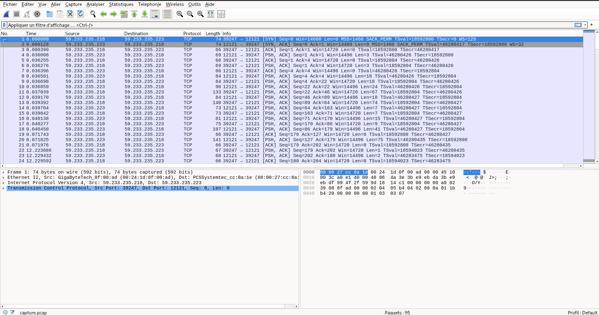

Voila l'intitulé du challenge :
```
World readable files strike again. Check what that user was up to, and use it to log into flag08 account.

To do this level, log in as the level08 account with the password level08. Files for this level can be found in /home/flag08.
```

Je commence donc par lister les élements à notre disposition :
```bash
level08@nebula:/home/flag08$ ls -la
total 14
drwxr-x--- 2 flag08 level08   86 2012-08-19 03:07 .
drwxr-xr-x 1 root   root      60 2012-08-27 07:18 ..
-rw-r--r-- 1 flag08 flag08   220 2011-05-18 02:54 .bash_logout
-rw-r--r-- 1 flag08 flag08  3353 2011-05-18 02:54 .bashrc
-rw-r--r-- 1 root   root    8302 2011-11-20 21:22 capture.pcap
-rw-r--r-- 1 flag08 flag08   675 2011-05-18 02:54 .profile
```

On y voit une capture du traffic réseau : `capture.pcap` ([disponible ici](https://github.com/crocogab/nebula-writeup/raw/HEAD/Challenge08/capture.pcap)).

Je la télécharge sur ma machine: `scp level08@nebula:/home/flag08/capture.pcap Cours/Challenge08/capture.pcap`

J'ouvre ensuite la capture réseau dans wireshark.

Il s'agit d'une connection qui utilise le protocole TCP.


On suit le flux TCP et obtient :
```
    00000000  ff fd 25                                           ..%
00000000  ff fc 25                                           ..%
    00000003  ff fb 26 ff fd 18 ff fd  20 ff fd 23 ff fd 27 ff   ..&.....  ..#..'.
    00000013  fd 24                                              .$
00000003  ff fe 26 ff fb 18 ff fb  20 ff fb 23 ff fb 27 ff   ..&.....  ..#..'.
00000013  fc 24                                              .$
    00000015  ff fa 20 01 ff f0 ff fa  23 01 ff f0 ff fa 27 01   .. ..... #.....'.
    00000025  ff f0 ff fa 18 01 ff f0                            ........ 
00000015  ff fa 20 00 33 38 34 30  30 2c 33 38 34 30 30 ff   .. .3840 0,38400.
00000025  f0 ff fa 23 00 53 6f 64  61 43 61 6e 3a 30 ff f0   ...#.Sod aCan:0..
00000035  ff fa 27 00 00 44 49 53  50 4c 41 59 01 53 6f 64   ..'..DIS PLAY.Sod
00000045  61 43 61 6e 3a 30 ff f0  ff fa 18 00 78 74 65 72   aCan:0.. ....xter
00000055  6d ff f0                                           m..
    0000002D  ff fb 03 ff fd 01 ff fd  22 ff fd 1f ff fb 05 ff   ........ ".......
    0000003D  fd 21                                              .!
00000058  ff fd 03 ff fc 01 ff fb  22 ff fa 22 03 01 00 00   ........ ".."....
00000068  03 62 03 04 02 0f 05 00  00 07 62 1c 08 02 04 09   .b...... ..b.....
00000078  42 1a 0a 02 7f 0b 02 15  0f 02 11 10 02 13 11 02   B....... ........
00000088  ff ff 12 02 ff ff ff f0  ff fb 1f ff fa 1f 00 b1   ........ ........
00000098  00 31 ff f0 ff fd 05 ff  fb 21                     .1...... .!
    0000003F  ff fa 22 01 03 ff f0                               .."....
000000A2  ff fa 22 01 07 ff f0                               .."....
    00000046  ff fa 21 03 ff f0 ff fb  01 ff fd 00 ff fe 22      ..!..... ......"
000000A9  ff fd 01 ff fb 00 ff fc  22                        ........ "
    00000055  ff fa 22 03 03 e2 03 04  82 0f 07 e2 1c 08 82 04   .."..... ........
    00000065  09 c2 1a 0a 82 7f 0b 82  15 0f 82 11 10 82 13 11   ........ ........
    00000075  82 ff ff 12 82 ff ff ff  f0                        ........ .
    0000007E  0d 0a 4c 69 6e 75 78 20  32 2e 36 2e 33 38 2d 38   ..Linux  2.6.38-8
    0000008E  2d 67 65 6e 65 72 69 63  2d 70 61 65 20 28 3a 3a   -generic -pae (::
    0000009E  66 66 66 66 3a 31 30 2e  31 2e 31 2e 32 29 20 28   ffff:10. 1.1.2) (
    000000AE  70 74 73 2f 31 30 29 0d  0a 0a 01 00 77 77 77 62   pts/10). ....wwwb
    000000BE  75 67 73 20 6c 6f 67 69  6e 3a 20                  ugs logi n: 
000000B2  6c                                                 l
    000000C9  00 6c                                              .l
000000B3  65                                                 e
    000000CB  00 65                                              .e
000000B4  76                                                 v
    000000CD  00 76                                              .v
000000B5  65                                                 e
    000000CF  00 65                                              .e
000000B6  6c                                                 l
    000000D1  00 6c                                              .l
000000B7  38                                                 8
    000000D3  00 38                                              .8
000000B8  0d                                                 .
    000000D5  01                                                 .
    000000D6  00 0d 0a 50 61 73 73 77  6f 72 64 3a 20            ...Passw ord: 
000000B9  62                                                 b
000000BA  61                                                 a
000000BB  63                                                 c
000000BC  6b                                                 k
000000BD  64                                                 d
000000BE  6f                                                 o
000000BF  6f                                                 o
000000C0  72                                                 r
000000C1  7f                                                 .
000000C2  7f                                                 .
000000C3  7f                                                 .
000000C4  30                                                 0
000000C5  30                                                 0
000000C6  52                                                 R
000000C7  6d                                                 m
000000C8  38                                                 8
000000C9  7f                                                 .
000000CA  61                                                 a
000000CB  74                                                 t
000000CC  65                                                 e
000000CD  0d                                                 .
    000000E3  00 0d 0a                                           ...
    000000E6  01                                                 .
    000000E7  00 0d 0a 4c 6f 67 69 6e  20 69 6e 63 6f 72 72 65   ...Login  incorre
    000000F7  63 74 0d 0a 77 77 77 62  75 67 73 20 6c 6f 67 69   ct..wwwb ugs logi
    00000107  6e 3a 20                                           n: 
```

Plusieurs éléments sont importants :
- `ff fd 25` : correspond au début de l'initialisation Telnet (existe aussi avec `ff fb 26`)
- `0x7f` : correspond au code ascii de la touche DEL
- `0x0d` : correpond a la touche RETOUR

On comprends donc assez bien ce qu'il se passe. Un utilisateur a utilisé Telnet pour acceder a des ressources et on a accès au dump réseau de cette connection.

Problème : Telnet est un protocole **legacy** et toutes les données de ce protocol transitent en clair sur le réseau.

### Exploitation

Sachant qu'il est assez clair de lire ce fichier grâce à wireshark. On va donc décomposer ce dump réseau en 3 parties :
1. L'initialisation du protocol
2. Le mot de passe
3. La fin de la connexion

La partie qui nous intéresse est celle qui suit : 
```
000000B2  6c                                                 l
    000000C9  00 6c                                              .l
000000B3  65                                                 e
    000000CB  00 65                                              .e
000000B4  76                                                 v
    000000CD  00 76                                              .v
000000B5  65                                                 e
    000000CF  00 65                                              .e
000000B6  6c                                                 l
    000000D1  00 6c                                              .l
000000B7  38                                                 8
    000000D3  00 38                                              .8
000000B8  0d                                                 .
    000000D5  01                                                 .
    000000D6  00 0d 0a 50 61 73 73 77  6f 72 64 3a 20            ...Passw ord: 
```
Cette partie correspond à l'entrée du nom d'utilisateur.

La partie qui suit nous donne directement le mot de passe avec un petit piège.
```
000000B9  62                                                 b
000000BA  61                                                 a
000000BB  63                                                 c
000000BC  6b                                                 k
000000BD  64                                                 d
000000BE  6f                                                 o
000000BF  6f                                                 o
000000C0  72                                                 r
000000C1  7f                                                 .
000000C2  7f                                                 .
000000C3  7f                                                 .
000000C4  30                                                 0
000000C5  30                                                 0
000000C6  52                                                 R
000000C7  6d                                                 m
000000C8  38                                                 8
000000C9  7f                                                 .
000000CA  61                                                 a
000000CB  74                                                 t
000000CC  65                                                 e
000000CD  0d                                                 .
```

Etapes :
1. L'utilisateur écrit : `backdoor` donc `pass=backdoor`
2. Il utilise ensuite 3 fois la touche DEL (`0x7f`) donc `pass=backd`
3. L'utilisateur écrit `00Rm8` donc `pass=backd00Rm8`
4. L'utilisateur utilise 1 fois la touche DEL (`0x7f`) donc `pass=backd00rm`
5. L'utilisateur écrit `ate` donc `pass=backd00Rmate`
6. L'utilisateur confirme le mot de passe avec `0x0d`

Donc le mot de passe est : `backd00Rmate`.

Il nous reste plus qu'à confirmer notre challenge :
```bash
level08@nebula:~$ su flag08
Password: 
sh-4.2$ id
uid=991(flag08) gid=991(flag08) groups=991(flag08)
sh-4.2$ /bin/getflag
You have successfully executed getflag on a target account
```

Bingo on a le flag !!!
